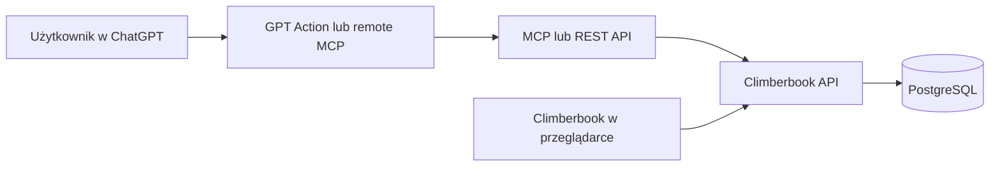

# Climberbook: Plan Refaktoru Cloud i GPT

## Cel

Climberbook ma obsługiwać zapis treningow przez rozmowę z GPT na telefonie. GPT zbiera szczegóły, potwierdza kompletny trening i zapisuje go dla właściwego użytkownika. Wpis ma pojawić się w aplikacji webowej po synchronizacji.

## Stan obecny

- Aplikacja Next.js przechowuje jeszcze dane lokalnie w IndexedDB, ale to warstwa historyczna/przejściowa.
- Dane nie są współdzielone pomiędzy przeglądarką, telefonem i GPT.
- Nie ma publicznego API, kont użytkowników ani zdalnej autoryzacji.

## Docelowa architektura



## Dane i migracja

- PostgreSQL jest źródłem prawdy dla użytkowników, zawodników, sekcji, treningów, przejść, wpisów wagi i ustawień.
- Każdy rekord należy do użytkownika lub zespołu.
- Schemat bazy korzysta z wersjonowanych migracji.
- Aplikacja udostępnia eksport obecnej IndexedDB do backupu JSON.
- Aplikacja importuje backup JSON do PostgreSQL z wykrywaniem duplikatów i podsumowaniem migracji.
- Frontend używa API, a lokalny cache może służyć wyłącznie jako wsparcie offline.

## Konta i połączenie GPT

1. Użytkownik zakłada konto Climberbook przez Google OAuth.
2. Backend tworzy wewnętrzny `userId` jako UUID.
3. Użytkownik wybiera w GPT opcję połączenia z Climberbook.
4. GPT przechodzi przez OAuth Climberbook, wykorzystując istniejącą sesję Google lub nowe logowanie.
5. Climberbook wydaje token ograniczony do danych danego użytkownika.
6. GPT zapisuje połączenie i wykorzystuje token przy kolejnych wywołaniach.
7. API zawsze odczytuje użytkownika z tokenu, a nigdy z pola `userId` wysłanego przez klienta.
8. Użytkownik może odłączyć integrację, co unieważnia jej token.

Google jest podstawowym dostawcą tożsamości. ChatGPT nie może być jedynym źródłem tożsamości użytkownika, chyba że używany mechanizm integracji gwarantuje kompatybilny, zweryfikowany OAuth.

## API

Minimalne endpointy:

```text
POST   /v1/trainings
GET    /v1/trainings
GET    /v1/trainings/{id}
PATCH  /v1/trainings/{id}
DELETE /v1/trainings/{id}

POST   /v1/ascents
POST   /v1/weight-entries
GET    /v1/athletes
POST   /v1/athletes
PATCH  /v1/athletes/{id}
GET    /v1/sync
```

Wymagania API:

- HTTPS, uwierzytelnienie oraz walidacja danych wejściowych.
- Brak bezpośredniego dostępu do bazy danych.
- Idempotency key dla operacji zapisu, aby ponowiona komenda głosowa nie tworzyła duplikatu.
- Audyt mutacji z użytkownikiem, czasem i źródłem (`web`, `gpt`, `import`).
- Operacje destrukcyjne wymagają dodatkowego potwierdzenia i nie są domyślnie dostępne w GPT.

## GPT: rozmowny zapis treningu

GPT prowadzi wywiad i nie zapisuje częściowego treningu. Wywołuje API dopiero po końcowym potwierdzeniu użytkownika.

Przykład:

```text
Użytkownik: Robiłem trening, zapisz.
GPT: Jaki trening robiłeś?
Użytkownik: Rozgrzewka, boulder, chwytotablica i lina.
GPT: Czy to wszystko?
Użytkownik: Tak.
GPT: Czy zapisać ten trening?
Użytkownik: Tak.
```

Payload zapisuje pełną wypowiedź oraz strukturę potrzebną do analiz:

```json
{
  "source": "gpt",
  "date": "2026-07-18",
  "rawDescription": "Najpierw rozgrzewka, potem boulder, chwytotablica i lina.",
  "summary": "Rozgrzewka, boulder, chwytotablica i lina.",
  "segments": [
    { "order": 1, "type": "warmup", "label": "Rozgrzewka" },
    { "order": 2, "type": "boulder", "label": "Boulder" },
    { "order": 3, "type": "hangboard", "label": "Chwytotablica" },
    { "order": 4, "type": "rope", "label": "Wspinanie z liną" }
  ]
}
```

GPT pyta o datę, zawodnika, czas trwania lub kalorie wyłącznie wtedy, gdy nie może ich ustalić z kontekstu albo są potrzebne do analizy.

## Protokoły ćwiczeń

Pytania są adaptacyjne i zależą od wykrytej aktywności.

Przykład dla drążka:

```text
GPT: Maksymalne powtórzenia czy serie?
Użytkownik: Serie.
GPT: Ile serii i powtórzeń?
Użytkownik: Cztery po dziesięć.
GPT: Z dodatkowym obciążeniem?
Użytkownik: Tak, 10 kg.
```

```json
{
  "type": "pull_up",
  "protocol": {
    "mode": "sets_reps",
    "sets": 4,
    "reps": 10,
    "additionalLoadKg": 10
  }
}
```

Dla chwytotablicy GPT może pytać o chwyt, liczbę serii, czas pracy, przerwę i obciążenie. Użytkownik może pominąć pole lub powiedzieć, że nie pamięta; GPT zapisuje wtedy `null` i nie zgaduje danych.

## Integracja GPT

Preferowany wariant to remote MCP z publicznym endpointem HTTPS i narzędziami:

```text
create_training
list_trainings
get_training
update_training
create_ascent
create_weight_entry
```

MCP używa Streamable HTTP oraz OAuth zgodnego z klientem ChatGPT. Jeżeli mobilny klient nie pozwala dodać własnego remote MCP, aplikacja udostępnia równoważne REST API opisane OpenAPI i podłączone jako Custom GPT Action.

## Integracje z urządzeniami i aplikacjami

Integracje uzupełniają ręcznie zapisany trening o automatycznie zebrane dane. Nie mogą nadpisywać danych wpisanych przez użytkownika lub zatwierdzonych przez GPT bez wyraźnej zgody.

### Zakres danych

- aktywności: rodzaj, rozpoczęcie, czas trwania, dystans, kalorie i źródło;
- dane fizjologiczne: tętno średnie i maksymalne, kroki, sen oraz masa ciała, gdy dostawca je udostępnia;
- żywienie: kalorie, makroskładniki i masa ciała, gdy użytkownik udzieli odpowiedniej zgody;
- zewnętrzny identyfikator rekordu, aby synchronizacja nie tworzyła duplikatów.

### Model integracji

- Każdy dostawca działa przez osobny adapter, np. `appleHealth`, `healthConnect`, `garmin`, `fitbit`, `fitatu`.
- Użytkownik łączy konto przez OAuth albo nadaje zgodę lokalnie w aplikacji mobilnej.
- Tokeny dostawców są szyfrowane i przechowywane wyłącznie po stronie serwera.
- Integracja przechowuje identyfikator zewnętrznego rekordu, czas ostatniej synchronizacji i status błędu.
- Synchronizacja jest idempotentna oraz pokazuje użytkownikowi źródło każdego importowanego wpisu.
- Użytkownik może wybrać typy synchronizowanych danych, wyłączyć integrację i usunąć jej tokeny.

### Platformy mobilne

- Apple Health / HealthKit wymaga natywnej aplikacji iOS lub odpowiedniego modułu mobilnego; sama aplikacja webowa/PWA nie ma pełnego dostępu do HealthKit.
- Android Health Connect wymaga natywnej aplikacji Android lub odpowiedniego modułu mobilnego.
- Integracje z Garmin, Fitbit, Polar lub podobnymi usługami korzystają z ich oficjalnych API i OAuth, o ile dostęp do danego API jest dostępny dla projektu.
- Fitatu należy integrować wyłącznie przez udokumentowane, oficjalnie dostępne API po uzyskaniu zgody użytkownika. Jeżeli nie oferuje publicznego API, pierwszym wariantem jest import eksportu danych, np. CSV lub JSON, zamiast nieoficjalnego pobierania danych.

### Łączenie z treningiem

- Po ręcznym lub głosowym zapisaniu treningu aplikacja może zaproponować połączenie go z aktywnością z zegarka o zbliżonym czasie.
- Automatycznie importowane aktywności są oznaczone jako `source: wearable` i wymagają potwierdzenia przed zastąpieniem ręcznej sesji.
- GPT może odczytać zsynchronizowane dane, np. czas, kalorie i tętno, i użyć ich jako kontekstu w podsumowaniu, ale nie może dopowiadać brakujących danych fizjologicznych.

## Hosting Azure

- MCP lub API może działać w Azure Container Apps.
- Publiczny ingress wymaga HTTPS.
- `minReplicas` powinno wynosić `1`, aby uniknąć cold startów dla poleceń głosowych.
- Sekrety są przechowywane w Azure Key Vault lub jako sekrety Container Apps.
- Wymagane są health checki, monitoring, rate limiting i limity zasobów.
- PostgreSQL nie może być publicznie dostępny.

## Synchronizacja

- Aplikacja webowa pobiera dane z API.
- Zapis z GPT jest widoczny w przeglądarce bez ręcznego odświeżania.
- Dopuszczalne mechanizmy: odświeżenie po aktywowaniu zakładki, polling, Server-Sent Events, WebSocket lub realtime bazy danych.

## Kryteria odbioru

1. Użytkownik loguje się do Climberbook przez Google.
2. Dane są trwale zapisane w PostgreSQL.
3. Backup IndexedDB można przenieść do konta.
4. Użytkownik łączy konto Climberbook z GPT przez OAuth.
5. GPT zapisuje kompletny, potwierdzony trening przez MCP albo Action.
6. GPT nie może zapisać danych dla innego użytkownika.
7. Trening zapisany z telefonu pojawia się w aplikacji webowej po synchronizacji.
8. GPT obsługuje adaptacyjne protokoły, m.in. drążek i chwytotablicę.
9. System nie tworzy duplikatów po ponowionym wywołaniu zapisu.
10. API i mechanizmy autoryzacji są objęte testami automatycznymi.
11. Użytkownik może połączyć i odłączyć obsługiwaną integrację oraz zdecydować, jakie dane synchronizuje.
12. Import aktywności z urządzenia nie tworzy duplikatów i nie nadpisuje ręcznie zapisanych danych bez potwierdzenia.
