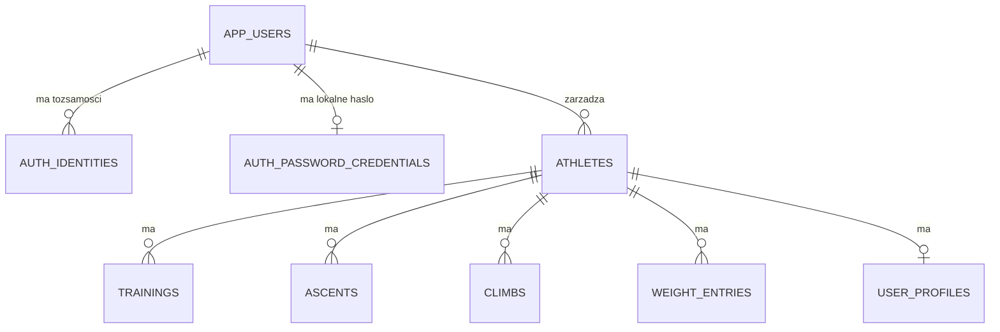
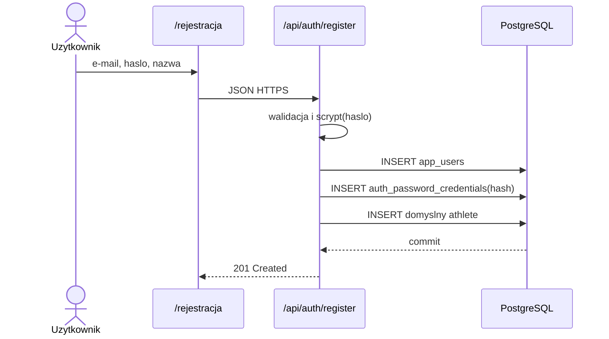
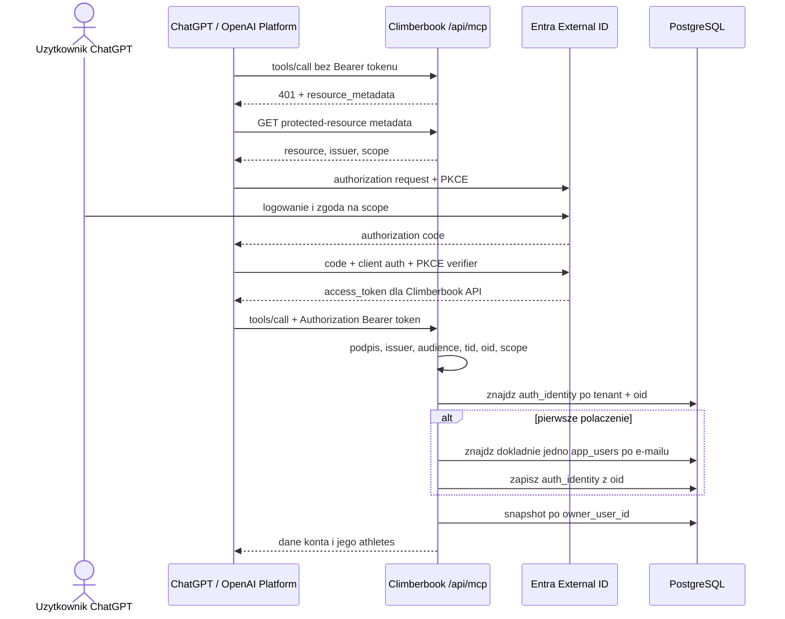
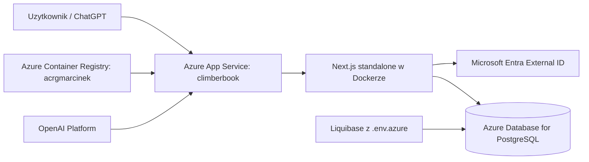

# Climberbook: konta, logowanie, MCP i infrastruktura

Dokument opisuje aktualny, wdrozony model. Sa dwa niezalezne sposoby
uwierzytelniania, ktore wskazuja na to samo konto Climberbook:

1. aplikacja Climberbook: e-mail i haslo, sesja Auth.js;
2. connector MCP ChatGPT: Entra External ID, OAuth 2.0 i access token Entra.

Obecny MCP ma tylko narzedzie odczytowe `get_climbing_snapshot`.

## Elementy systemu

| Element                   | Znaczenie                                           | Miejsce                     |
| ------------------------- | --------------------------------------------------- | --------------------------- |
| Konto Entra External ID   | Tozsamosc OAuth dla MCP; posiada stabilne `oid`     | Entra `climberbookid`       |
| Konto Climberbook         | Wlasciciel danych aplikacji                         | `app_users` w PostgreSQL    |
| Lokalne haslo             | Logowanie do `/login`; przechowywany tylko hash     | `auth_password_credentials` |
| Powiazanie tozsamosci     | Laczy Entra lub innego providera z kontem aplikacji | `auth_identities`           |
| Athletes                  | Wlasciciel i jego podopieczni                       | `athletes.owner_user_id`    |
| ChatGPT / OpenAI Platform | Klient MCP i OAuth                                  | OpenAI                      |

Konto Entra nie jest automatycznie kontem Climberbook. Entra potwierdza
tozsamosc, a PostgreSQL jest zrodlem danych i ich wlasciciela.

## Dane i izolacja



`auth_identities` ma unikalna pare `(provider, provider_subject)`. Dla Entra:

```text
provider         = entra:<ENTRA_TENANT_ID>
provider_subject = oid z access tokenu
```

Po pierwszym polaczeniu kolejne zadania sa mapowane po `oid`, nie po e-mailu.
Zapytania danych sa ograniczone przez `owner_user_id`: snapshot MCP obejmuje
dane wlasciciela i jego athletes, ale nie dane innych kont.

## Rejestracja i logowanie aplikacji

### Rejestracja

`/rejestracja` wywoluje `POST /api/auth/register`. Serwer waliduje dane,
wylicza hash `scrypt`, tworzy `app_users`, zapisuje hash w
`auth_password_credentials` i dodaje domyslnego athlete. Haslo jawne nie jest
zapisywane w PostgreSQL.



### Zwykle logowanie

`/login` uzywa `CredentialsProvider` Auth.js. Serwer odczytuje hash po
e-mailu, porownuje go przez `scrypt`, a Auth.js zapisuje podpisana sesje JWT w
cookie przegladarki. To cookie nie jest tokenem Entra i nie daje dostepu MCP.

Google i Facebook, gdy sa skonfigurowane, sa oddzielnymi providerami Auth.js.
One takze korzystaja z `auth_identities`, ale nie sa logowaniem MCP.

## OAuth Entra dla MCP

### Co odkrywa ChatGPT

ChatGPT laczy sie z `POST /api/mcp`. Bez tokenu otrzymuje `401` z naglowkiem
`WWW-Authenticate`, ktory wskazuje:

```text
/.well-known/oauth-protected-resource
```

Endpoint zwraca resource, Entra authorization server i scope. Entra External
ID nie obsluguje tu dynamic client registration, wiec OpenAI Platform musi
uzywac recznie skonfigurowanego klienta OAuth.

```text
Resource:
https://climberbookid.onmicrosoft.com/fc074382-cfff-41b5-b1c5-815b4cb31cd5

Scope:
https://climberbookid.onmicrosoft.com/fc074382-cfff-41b5-b1c5-815b4cb31cd5/climberbook.access

OAuth client ID:
f980882a-9b5d-44c4-812b-54e807f5c606

Token endpoint authentication:
Client Secret Post
```

Sekret klienta OAuth pozostaje w OpenAI Platform. Nie nalezy go umieszczac w
repozytorium, obrazie Docker ani logach.

### Przebieg autoryzacji



Backend odrzuca token, gdy brak naglowka Bearer, podpis/JWKS jest bledny,
`iss` lub `aud` nie pasuja, `tid` jest z innego tenant'a, brak `oid`, albo
`scp` nie zawiera `climberbook.access`.

Access token sluzy tylko do MCP i ma ograniczony czas zycia. Nie jest
zapisywany w bazie Climberbook. `offline_access` moze umozliwic klientowi OAuth
odswiezanie tokenow, jezeli pozwala na to polityka Entra.

### Pierwsze powiazanie kont

Pierwsze wywolanie MCP tworzy powiazanie tylko gdy:

1. istnieje konto `app_users`;
2. Entra zwraca e-mail w `email`, `preferred_username` lub `upn`;
3. dokladnie jedno konto Climberbook ma ten sam e-mail bez wzgledu na wielkosc
   liter.

Jesli warunek nie jest spelniony, MCP zwraca `403`. Nie tworzy konta i nie
ujawnia danych innego uzytkownika.

## Infrastruktura produkcyjna



| Usluga                                  | Zadanie                                   |
| --------------------------------------- | ----------------------------------------- |
| Azure Container Registry `acrgmarcinek` | Przechowuje obrazy `climberbook:<wersja>` |
| Azure App Service `climberbook`         | Uruchamia konkretny tag obrazu Next.js    |
| Azure Database for PostgreSQL           | Konta, powiazania i dane treningowe       |
| Liquibase                               | Wersjonowane migracje z `db/changelog`    |
| Entra External ID                       | Logowanie OAuth i tokeny API              |
| OpenAI Platform                         | Konfiguracja pluginu i klient OAuth/MCP   |

Najwazniejsze zmienne App Service:

| Grupa                      | Przyklady                                                                                                                                |
| -------------------------- | ---------------------------------------------------------------------------------------------------------------------------------------- |
| PostgreSQL                 | `POSTGRES_HOST`, `POSTGRES_DB`, `POSTGRES_USER`, `POSTGRES_PASSWORD`, `POSTGRES_SSLMODE`                                                 |
| Entra                      | `ENTRA_TENANT_ID`, `ENTRA_API_CLIENT_ID`, `ENTRA_API_RESOURCE`, `ENTRA_ISSUER`, `ENTRA_OPENID_CONFIGURATION_URL`, `ENTRA_REQUIRED_SCOPE` |
| MCP test                   | `ENTRA_MCP_CLIENT_ID`                                                                                                                    |
| Auth.js                    | `AUTH_SECRET`, opcjonalnie `AUTH_GOOGLE_*`, `AUTH_FACEBOOK_*`                                                                            |
| OpenAI domain verification | `OPENAI_APPS_CHALLENGE_TOKEN`                                                                                                            |

Hasla PostgreSQL, `AUTH_SECRET`, sekrety providerow Auth.js, OAuth client
secret i token weryfikacji domeny sa sekretami. Nie wolno ich zapisywac w
repozytorium, obrazie Docker, dokumentacji ani czacie.

Migracje Liquibase trzeba wykonac przed przelaczeniem App Service na obraz,
ktory zalezy od nowego schematu. Rola `climberbookdb_admin` jest wlascicielem
schematu/migracji. Aplikacja laczy sie jako `climberbook_app` z minimalnymi
uprawnieniami. Migracja `017` dodala jej prawa do
`auth_password_credentials`, wymagane przez rejestracje lokalnego konta.

## Rejestracja przez GPT i odwrotnie

### Stan obecny

Nie. Plugin MCP jest tylko do odczytu, zatem:

- ChatGPT nie tworzy konta Entra;
- ChatGPT nie tworzy `app_users` Climberbook;
- rejestracja Climberbook nie tworzy konta Entra;
- rejestracja Entra nie tworzy konta Climberbook.

Nowy uzytkownik MCP potrzebuje obecnie obu kont z tym samym e-mailem. Pierwsze
udane wywolanie MCP tworzy wylacznie `auth_identities`, nie konto domenowe.

### Bezpieczny kierunek rozwoju

Najlepiej zrobic osobny onboarding webowy: uzytkownik przechodzi przez
self-service sign-up Entra, backend po zweryfikowanym callbacku tworzy
`app_users`, domyslnego athlete i `auth_identities` w jednej transakcji.

Mozna kiedys dodac narzedzie MCP np. `start_account_registration`, ale nie
powinno przyjmowac hasla w czacie ani tworzyc konta po samym wolnym tekscie.
Wymagaloby nowych scopes, jawnej zgody, ochron antynaduzyciowych, testow i
adnotacji narzedzia zapisujacego dane. `get_climbing_snapshot` powinno pozostac
narzedziem odczytowym.

## Checklista operacyjna

### Nowy uzytkownik MCP

1. Tworzy konto Entra External ID.
2. Tworzy konto Climberbook z tym samym e-mailem.
3. Autoryzuje plugin w ChatGPT.
4. MCP tworzy jednorazowe powiazanie po e-mailu.
5. Dalsze zadania sa mapowane po Entra `oid`.

### Zmiana MCP

1. Zmien kod i metadane narzedzi.
2. Uruchom typecheck/build.
3. Zbuduj i wypchnij nowy tag do ACR.
4. Zastosuj migracje Liquibase.
5. Przelacz App Service na konkretny tag i sprawdz health endpoint.
6. Wykonaj ponowny Scan Tools w OpenAI Platform, gdy zmienily sie metadane.
